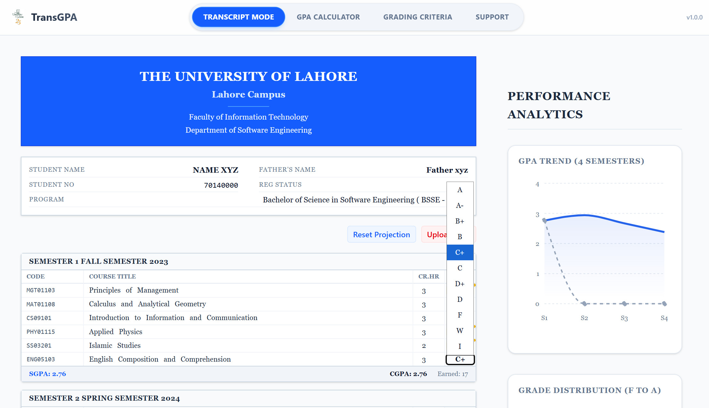

# TransGPA 🎓

**TransGPA** is a powerful academic tool designed to help students visualize, plan, and optimize their educational journey. It transforms static transcript PDFs into dynamic, interactive dashboards, empowering students to take control of their CGPA.



## 🚀 The Problem
University transcripts are often static PDF documents. They tell you *what happened*, but they don't help you plan *what's next*. Students struggle to answer simple questions like:
- *"What specific grades do I need next semester to reach a 3.5 CGPA?"*
- *"If I retake this 'D' grade and get an 'A', how much will my CGPA improve?"*
- *"What is my GPA trend over the last 4 semesters?"*

## 💡 The Solution
**TransGPA** parses your official transcript directly in the browser (zero privacy risk!) and converts it into a malleable dataset.
- **Simulate**: Click any grade to change it and see the impact instantly.
- **Project**: Add future semesters and hypothetical courses to roadmap your degree.
- **Analyze**: Visualize your performance with professional-grade charts.


## 🛠️ Technology Stack
Built with modern web technologies for speed, performance, and type safety.

- **Framework**: [React 19](https://react.dev/)
- **Language**: [TypeScript](https://www.typescriptlang.org/)
- **Build Tool**: [Vite](https://vitejs.dev/)
- **Styling**: [Tailwind CSS](https://tailwindcss.com/)
- **Visualization**: [Recharts](https://recharts.org/)
- **PDF Processing**: [pdfjs-dist](https://mozilla.github.io/pdf.js/)
- **Icons**: [Lucide React](https://lucide.dev/)

---

## 🔒 Privacy First
TransGPA follows a strictly **Client-Side** architecture.
- **No Server Uploads**: Your PDF file is processed entirely within your browser's memory using Web Workers.
- **No Database**: We do not store your grades, student ID,etc.
- **Zero-Knowledge**: Once you close the tab, your data is gone.

---

## 🏁 Getting Started

### Prerequisites
- Node.js (v18 or higher)
- npm or pnpm

### Installation

1. **Clone the repository**
   ```bash
   git clone https://github.com/harisizm/TransGPA.git
   cd TransGPA
   ```

2. **Install dependencies**
   ```bash
   npm install
   ```

3. **Environment Setup**
   - Rename `.env.example` to `.env` in the root directory.
   - Add your MongoDB connection string.

### 🚀 Running the Application

Open two terminal windows in the project root:

1. **Start Backend Server** (Terminal A)
   ```bash
   npm run server
   ```
   Runs on `http://localhost:5000`

2. **Start Frontend Client** (Terminal B)
   ```bash
   npm run dev
   ```
   Runs on `http://localhost:5173`

### 🛠️ Troubleshooting & Local Config
- **API Connection**: For local development, keep `VITE_API_URL` blank in your `.env` file. This allows the Vite proxy to handle requests correctly and prevents `ERR_CONNECTION_REFUSED`.
- **Database**: Ensure your `MONGO_URI` in `.env` is a valid connection string starting with `mongodb://` or `mongodb+srv://`.
- **Environment**: Always run commands from the project root to ensure `.env` variables are loaded correctly by both the client and server.

4. **Build for production**
   ```bash
   npm run build
   ```


## ❤️ Support
If you find this tool useful, feel free to reach out on LinkedIn!
